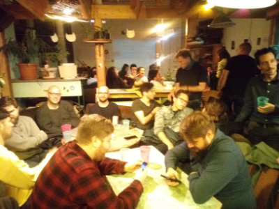

We are proud to announce that the Felfele alpha release is [out](/app)! It was quite a journey, with many risks, and a long to-do list: setting up the Foundation, create proof of concept versions, iterating, redesigning. But we had a lot of support. We are thankful for all the people who helped us, some with ideas and being there when we needed someone to talk to, but also coding, working on design materials, or testing the early versions of the application. We even had a pre-alpha release event, where we introduced the app to a bunch of people, making it the first group user test as well. Important usability issues and bugs were found, and fixed :-)

## So what can you expect from this alpha version?
We are still just at our first alpha version, but we aimed to put together an app which can be useful as it is: you can post text and images, follow other people, re-share their posts, or follow blogs, news sites, reddit pages, via RSS feeds. Because we are not collecting private information, we cannot provide a search functionality of other users at the moment. You can send your channel’s link to your friends in a text message, or just open your profile and show your QR code to your friend, and they will be able to read it from the app. In our experience it's a fun method of building small communities. This is still a version which focuses on some technical foundations, it's by no means representative of the product which will be our public release. If you feel lost, have a look at the [user manual](/blog/manual-1). It's possible you'll find usability issues we haven't thought of, bugs that we haven't discovered yet, even content loss is a possibility, at this point we cannot guarantee anything, it's better to treat your content ephemeral. Make sure to report the issues you experience!

## Why are we doing this
We are tired of the exploitative nature of traditional social media, and the attention economy revolving our online activities. You can read more about our motivation here.

## How to contribute
Hopefully we will get to know a lot of people during the alpha. This was just our first milestone, and we welcome everyone who wishes to move our cause forward. You can [contribute](https://github.com/felfele/felfele/blob/master/CONTRIBUTING.md) by reporting issues, or by opening pull requests! We are looking for volunteers for non-development tasks as well. And of course, if you cannot contribute with your time, you can always make a [donation](https://felfele.com/donation).

## What's next?
Currently your channel (your posts) in the application can be viewed by anyone who has the link to it. The address cannot be guessed, and it's not indexed by any search engine, but if you share it with someone, it can be re-shared, so we advise to treat it as a public channel. This is the first thing we are planning to address in our next milestone, enabling the app to generate encrypted content, where only the people can read it who you have specifically shared it with.
