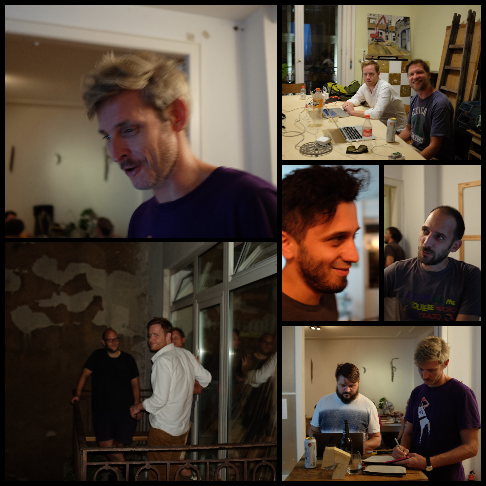
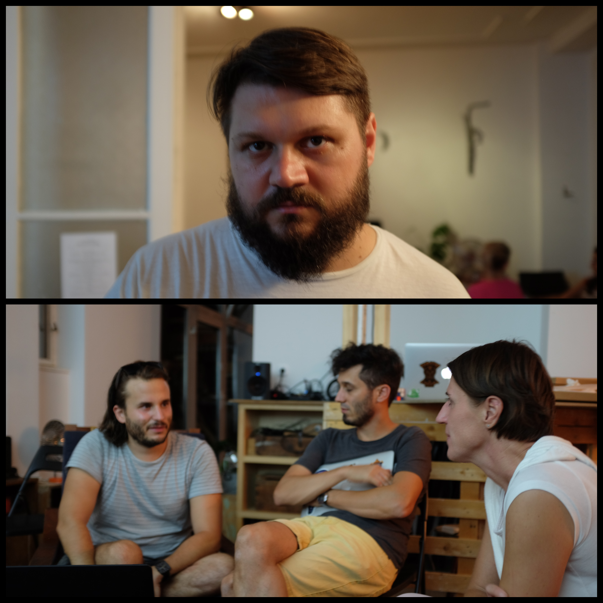
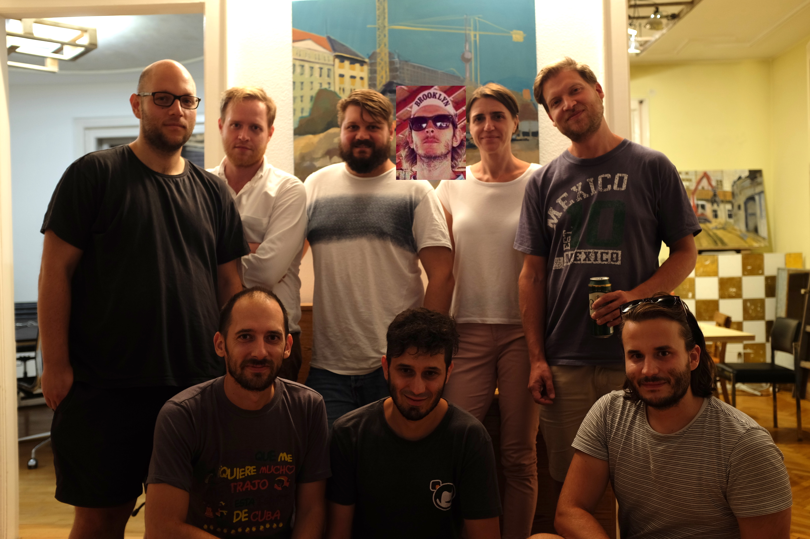

We have organized our first product design hackathon on the 13th of September. This was a private, invite only event, we are still testing our initial concepts in our network. The event was held at a very friendly coworking office / atelier, Flux Workspace, Budapest. The participants were of mixed background, designers, engineers, market research, QA, etc. The goal was to bring in some fresh thoughts regarding a number of topics, which were the following:

- find new ways of sharing
- reinvent the timeline
- handle multiple identities
- explore content

After the Q&A and some debate, 3 teams were formed, and we have started to work on the ideas around 8 o'clock. The brainstorming and the work lasted until 11pm, when we have gathered to show the results to each other.

The bad news is that most of the video documentation got lost 😔

The good news is that we have decided to use the results of all 3 projects 😊

The first team to present took a really big challenge: how to handle multiple identities in a privacy conscious social app, taking into account the posting workflow. Sketch file [here](https://sketch.cloud/s/jrvGm/all/page-1/artboard-2).

<iframe src="https://drive.google.com/file/d/1tq_94uxqrUC3GMOburVdEmUbwWxtAVB9/preview" width="700" height="393"></iframe>

The second team's project was to reinvent the timeline, and spicing up the style as well. Check it out on [sketch](https://sketch.cloud/s/JJg0G/all/page-1/a4-copy-2)!

<iframe src="https://drive.google.com/file/d/1abRbMZkC2OipDOF3rhLY_6shFMkaWNSn/preview" width="700" height="393"></iframe>

The last team wanted to tackle the problem of news recommendation, which can be challenging on a new platform. [Here](https://www.figma.com/file/RxcHzdWqS9jjP1FNdovUMVj1/Social-App-Feed?node-id=0%3A1) you can check out the wireframe.

<iframe src="https://drive.google.com/file/d/1P2qtre-sFOAS-rfrNhh4yyEvW6Anwmry/preview" width="700" height="393"></iframe>

The energy was great throughout the evening, and we were happy with the results. Thanks again for everyone who participated, hopefully we will have some similar events in the future, we would be glad to see you again!

