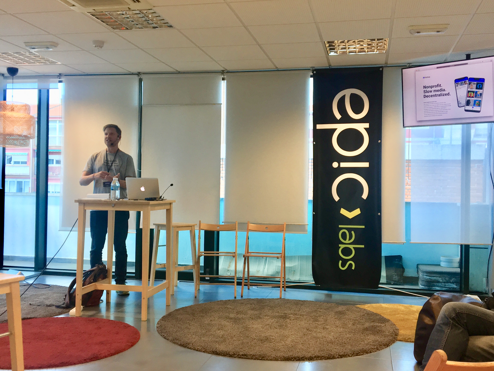
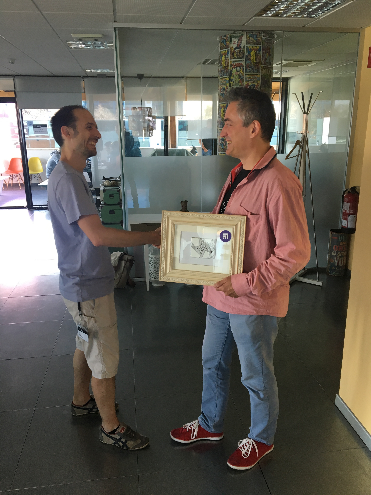

We are back from Swarm Orange Summit Madrid edition, where we presented about how we use Ethereum Swarm to build a fully decentralized, mobile-first social application.

Swarm Orange Summit is a yearly gathering where the core Swarm team and members of the community present about their work, and discuss the possible futures of the technology. If you are interested in decentralization, and you haven't heard about Swarm yet, you should head to their [website](https://ethswarm.org) to learn about an incentivised p2p storage network! This year Epic Labs hosted the event in their Madrid office. Kudos to them for making it happen!

From the Felfele team Attila Gazso took the stage to [present](https://prezi.com/qhpiczkatr-r) about the current stage of our project. He talked about the motivation for building social network and the challanges we face. He introduced to the community the social APIs we build, which enables any application developer to interface with the social network. To demonstrate it, we built a [command line tool](https://github.com/felfele/felfele/tree/master/src/cli) to post updates and query data.

We hosted a lottery during the summit, where anyone could apply by [donating](https://felfele.org/donate) to the foundation. It was an exceptional present: a Mighty Wallet hand-drawn by our director of design, David. It's a one of a kind item, and the happy winner was Adam Schmideg, from the Ethereum Foundation, congrats!

