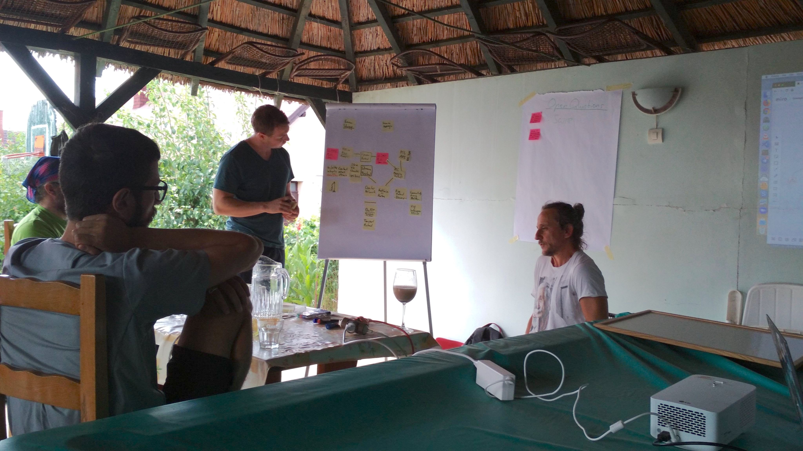

Last week I participated three days at the Swarm Hack Week 2019 at Lake Balaton, Hungary. My goal was to do discovery work on the [mobile build of the Swarm codebase](https://github.com/ethersphere/user-stories/issues/27) for the Felfele app. I met new people from the Swarm team, learned about their current roadmap to 1.0. It was great to see the focus on implementing incentivisation because that means Swarm is becoming production ready and people can start developing new applications with novel business models on the platform.

Of course we were brainstorming and discussing new, sometimes crazy ideas about this decentralized world. These all are my impressions and it's not what the Swarm team is committed to build. Still I wanted to write down some of these ideas before I forget them, knowing that some of them are not really mature or feasible at the moment, but maybe this might inspire someone.

### BZZ Nonce One Time Protocol

Sharing between different devices, platforms and app can be difficult, because everything requires some kind of pairing process (proof of mutual trust) before sharing and that generates friction. At the minimum you have to exchange phone numbers, then agree on an app that you both use, possibly you have to download that app, add someone as friend and after that you can send photos.

What if sharing (or receiving) things were as easy as scanning a QR code with your phone? We came up with a one-time key-exchange protocol, that can be used in wide ranges of applications. For example sharing a photo, logging in to a dapp with MFA, remote control a laptop or TV from your phone becomes possible. If there is an open protcol that can be reused then you don't even have to use the same app for sharing.

The first step of this protocol is responsible for setting up a two-way encrypted communication channel over Swarm Feeds and after that any other communication protocol can be implemented. The application specific protocols can be standardised later, but only for the key-exchange protocol there is already a [draft proposal here](https://github.com/felfele/felfele/issues/441).

### Storing encrypted data on Swarm protected with a password

Storing encrypted data on Swarm is a trivial use-case, however the best practice to store encrypted information in a publicly available network is to use long enough (e.g. 256 bits) cryptographically secure random secrets which are extremely hard to memorize or to just keep safe.

There is a way how you can use ordinary passwords to protect and share information over Swarm. It still uses a random secret to encrypt your data and you will get back the random hash of the encrypted data. If you concatenate the hash and the secret (together called a reference), Swarm can return you the decrypted data.

However you can encrypt that reference with an ordinary password and if you are using a block cypher without adding metadata to your data, the encrypted reference will have the same length as your original reference. Now your password encrypted reference looks just like a normal reference, and if someone wants to brute-force the password, they have to try all the possible permutations for the password _and_ download the content in order to verify. Therefore you can share the password encrypted reference in a less trusted channel and share the password on a different channel in practical applications.

While trying out all permutations is indeed feasible nowadays with lots of CPU capacity, downloading all the content to verify it can has a significant cost and time on the Swarm network that can be calculated ahead. If it turns out that a single password does not provide enough entropy (=cost) for protecting content, it's also possible to use some kind of salt mechanism to grow the search space.

Applications of this can be file sharing, storing backups or even private keys, personal/private information etc.

### Swarm Multiverse

When thinking about Swarm we usually have a single, global, public network in our mind. However this is still a centralised way of thinking about it and therefore it shares some of the problems of centralised systems. What if the public Swarm network is blocked in your country? What if you don't want to share private and personal information with everyone (even encrypted)? What if you want better control over what you share with whom?

It turns out it's possible to have many parallel Swarm universes in existence at the same time. There is a `NetworkID` which can be used to separate different Swarm networks. Right now it is used for separating test networks from the production version, but it can be used to set up your own private Swarm network that you only share with certain friends. Applications can be written in a way that they also include the `NetworkID` in the links they use and then accessing data over many networks is possible.

For example apps can use a single, isolated, local Swarm instance as their local data store and then use higher level synchronization libraries to synchronize data across different networks. This makes the app developer's life easier, because they don't have to write synchronization code between local and remote data, but reuse existing solutions.

### Swarm DB

Talking about reusing data structures, one of the most straightforward abstraction could be a database over Swarm. It could be built in a layered architecture, using singly-link lists and feeds as the basic layer ([see Timelines from Erebos](https://erebos.js.org/docs/timeline-spec)).

Then over this can be an event log with operations for `Update`s and `Delete`s (and possibly a `Snapshot` operation will come handy for performance reasons). With that mutable data can be stored in the structure. This log can be built in a way that it can be always merged with other logs without conflicts. These kind of structures are called [CRDT](https://en.wikipedia.org/wiki/Conflict-free_replicated_data_type)s and there can be other primitive types built in this layer, like counter, set etc. This so far would be very similar to what [OrbitDB](https://github.com/orbitdb/orbit-db) does.

Application developers can use these primitives to build abstractions on top of them, that matches more closely the problem domain. For example someone can build a news feed or a photo album for a social app in a way that can automatically synchronize between devices and contacts. These can be libraries themselves that can be reused between different apps, helping collaboration and interoperability.

### Running code on Swarm as capability

Using higher level abstraction libraries also mean that the data is stored in a more structured ways, which can be processed and transformed by programs. With the upcoming adaptive node feature, Swarm becomes a system where you can turn certain features on and off, maybe even when running a node.

What if there would be a capability for running an Ethereum Virtual Machine or some other kind of virtual machine which could download and execute code from the Swarm network? Swarm itself could use its accounting and incentivisation system to set the prices automatically and it would be possible to create services that does calculations off-chain so it would be cheaper than on the Ethereum chain, because it could be scaled up easier (not everyone would calculate the same data).

Then it would be possible to do many kind of conversions between different apps and protocols automatically, or there could be background processes that checks some things for a mobile app while the app is offline etc. Heck, it would even be possible to store all the blockchain data on Swarm could also run the blockchain consensus mechanism as a capability itself.

### Conclusion

Some of this may seem far fetched as of now, but the possibilities can be seen already and we at Felfele really believes that the decentralized future is not only going to be more private and fair but at the same time it will be able to offer better user experience and control to the people as well. Let's buidl together!
